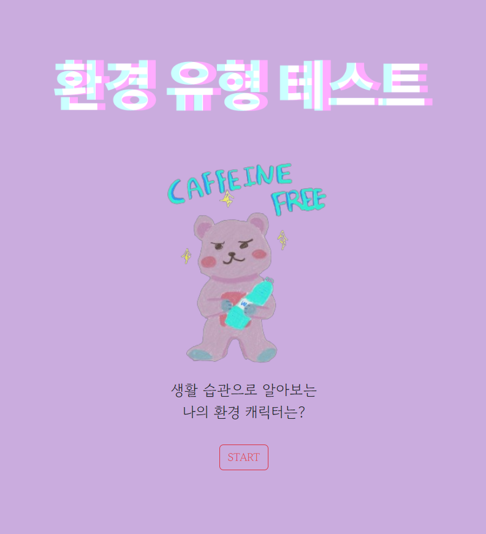
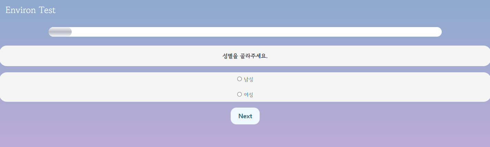
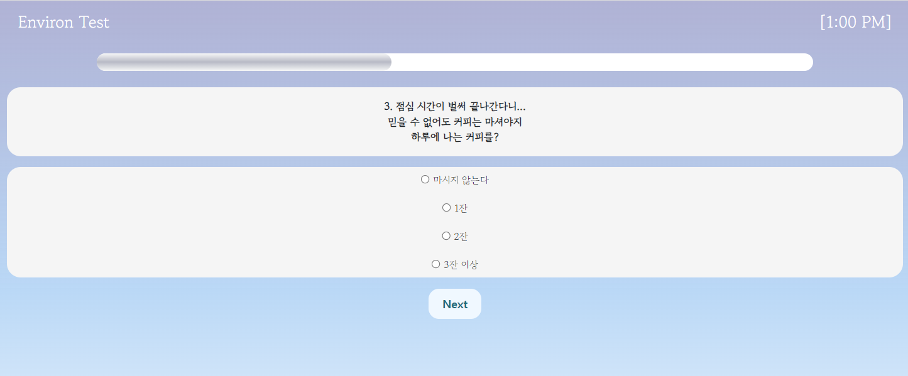
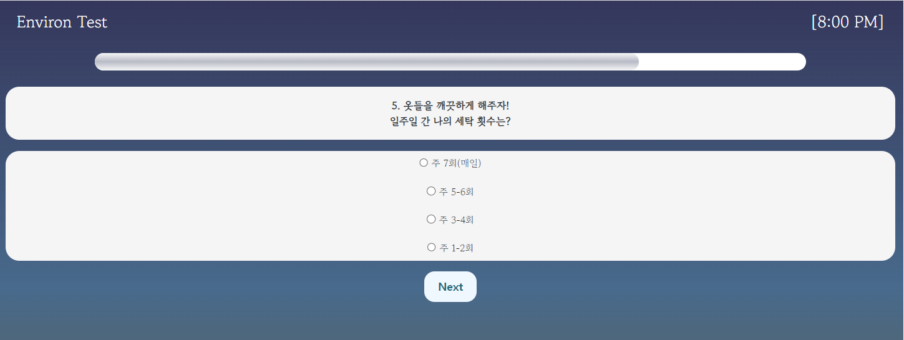
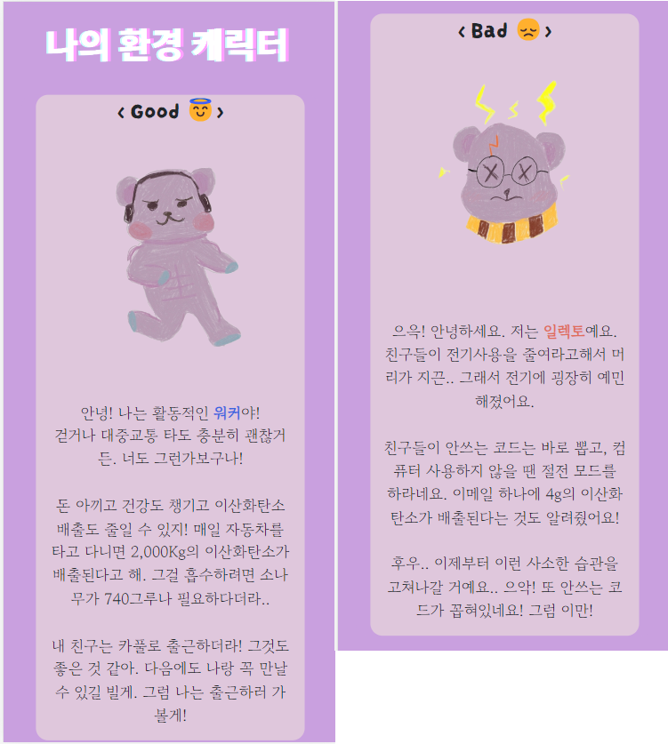
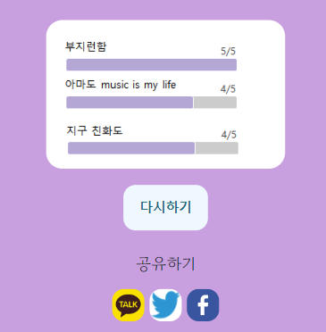

## 개요
탄소배출과 관련된 사람들의 생활 습관 데이터를 수집하기 위해 만든 django 기반 웹페이지 코드입니다.
총 16개의 질문으로 구성된 테스트로, 테스트 결과에 따라 환경 캐릭터를 사용자에게 보여줍니다.

- 테스트 시작
  


- 테스트 화면








- 결과창





## 로컬에서 실행
```
git clone https://github.com/jsh0551/DA_PROJECT.git
pip install -r requirements.txt
python manage.py makemigrations project_apps
python manage.py migrate project_apps
python manage.py runserver
```

### GCP 배포 시
 - DA_PROJECT/settings.py -> DATABASES 수정
 - project_apps/views.py -> createform 함수의 return 수정
 - project_apps/static/js/start.js -> result_post 함수의 postform.action 수정
 - templates/result.html -> 'replay w-btn w-btn-indigo py-3' 클래스의 onclick 속성 수정

## 데이터 분석 결과

https://docs.google.com/document/d/1KOfg3ccQ4m9jvaJfuABAnThUtqF0x9Kmpxf_jkOXFg8/edit?usp=sharing
